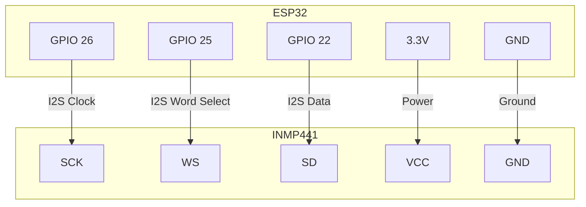

# System Diagram: ESP32 with INMP441 I2S Microphone

This diagram shows the connection between the ESP32 and the INMP441 I2S microphone.

## Connections

| INMP441 Pin | ESP32 Pin | Description      |
|-------------|-----------|------------------|
| SCK         | GPIO 26   | I2S Serial Clock |
| WS          | GPIO 25   | I2S Word Select  |
| SD          | GPIO 22   | I2S Serial Data  |
| VCC         | 3.3V      | Power            |
| GND         | GND       | Ground           |
